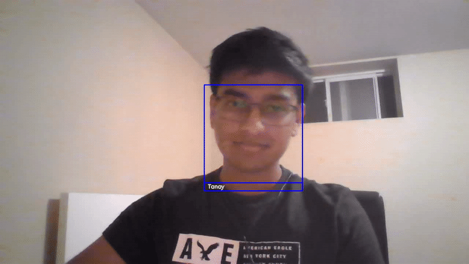

# FaceLog
#### Coded by Tanay Patel
 
 
## What is this?
 
In this project I've created a Python application which is able to restrict computer access using facial recognition. The application uses OpenCV to identify and label multiple people in real time to ensure they've been given access to the computer.
 
The code can also be modified to take in any video stream input like a phone camera! Overall I am very happy with how this project turned out and I've even implemented this code in all my family business's computers.
 
 
 
## Example of identifying faces in a video
 

## Multiple Face Identification 
(Obama and Tanay)
 

 
